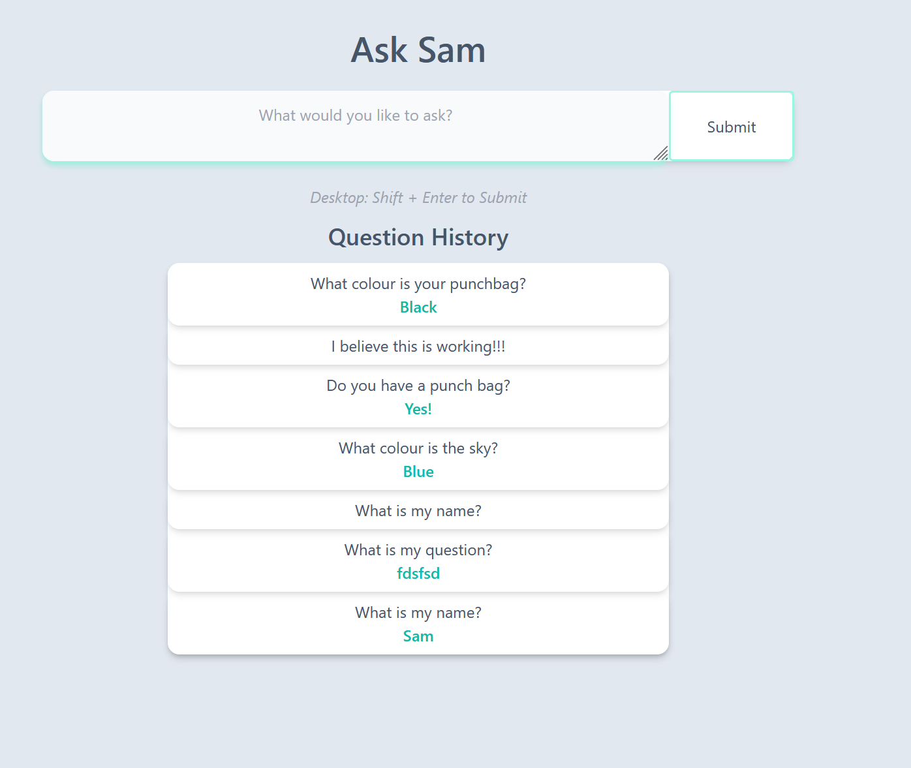

# Ask Sam (Client)

This front end app allows anyone to ask anonymous questions, and have them answered with the objective to teach and help cultivate new perspectives on many things in life.

Technical flow of app

    User loads the page
      React checks if there is a cookie with the same of "clientId"
        if no:
          Displays Cookie notification
            If User accepts cookies:
              Sends GET request to /questions/getclientid which returns a random guid
              Stores the guid in a cookie
              React sends GET request to /questions/{clientid} which returns all the questions in the database with the clientId attached.
              React populates question list.
            If User declines cookies:
              Check if there is an existing cookie and delete,
                otherwise, do nothing.
    User submits a question
      React sends POST request to server posting the data (guid, question, answered, answer).
      React sends GET request to /questions/{clientid} which returns all the questions in the database with the clientId attached.
      React populates question list.